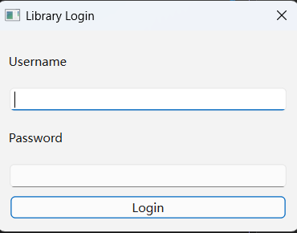
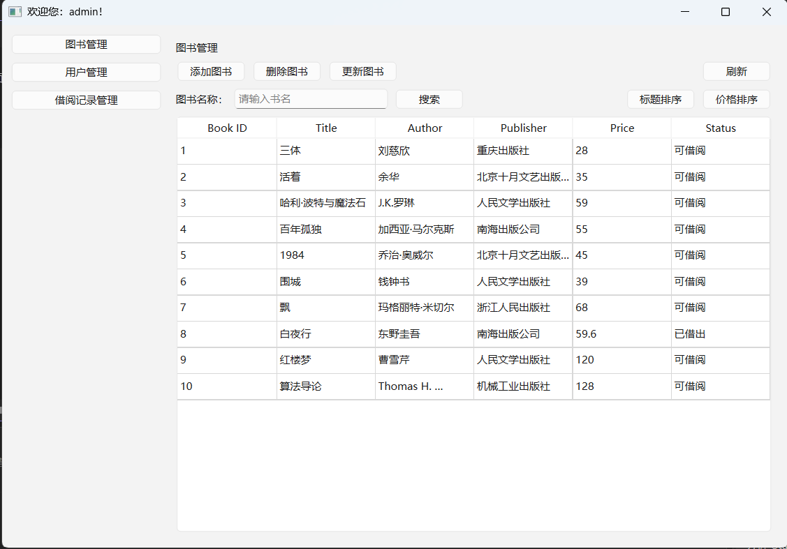
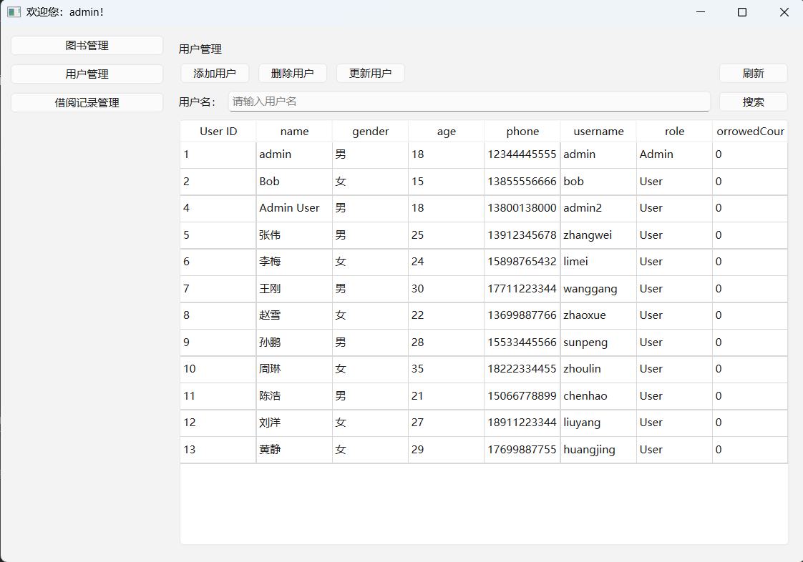
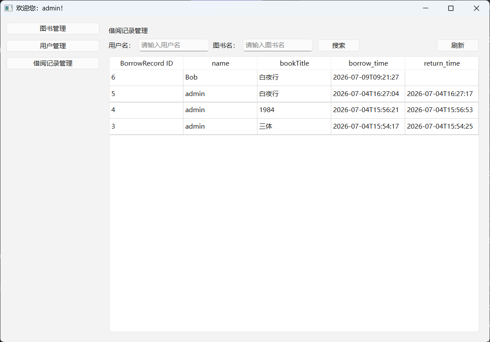

# LibrarySystem

> 基于 **C++20 + Qt6 + SQLite** 开发的桌面图书管理系统，采用 Repository + Service + Controller 三层架构，实现了登录认证、RBAC 权限控制、图书管理、用户管理及借阅管理等功能。

---

## 项目预览

- 登录界面
- 
- 图书管理
- 
- 用户管理
- 
- 借阅管理
- 

---

# 技术栈

| 技术 | 说明 |
|------|------|
| C++20 | 核心开发语言 |
| Qt6 Widgets | GUI 框架 |
| SQLite | 数据存储 |
| CMake | 项目构建 |
| Git | 版本管理 |
| Repository Pattern | 数据访问层 |
| Service Layer | 业务逻辑层 |
| Controller | 控制层 |
| RBAC | 基于角色的权限控制 |

---

# 项目功能

## 登录认证

- 用户登录
- 登录状态管理
- 身份认证

---

## 用户管理

- 新增用户
- 修改用户
- 删除用户
- 查询用户

---

## 图书管理

- 新增图书
- 修改图书
- 删除图书
- 模糊查询
- 排序

---

## 借阅管理

- 借书
- 还书
- 借阅记录查询

---

## 权限管理

采用 **RBAC（Role-Based Access Control）** 权限模型。

已实现：

- 页面权限
- 操作权限
- 不同角色显示不同菜单
- 不同角色拥有不同操作权限

---

# 项目架构

```
                Qt Widgets UI
                      │
               Controller Layer
                      │
                Service Layer
                      │
              Repository Layer
                      │
                   SQLite
```

各层职责：

### UI

负责界面展示。

### Controller

负责接收界面请求，调用业务层。

### Service

负责业务逻辑处理。

### Repository

负责数据库访问。

---

# 项目目录

```
LibrarySystem
│
├── app/                  管理整个程序的入口
├── common/               可复用的工具库
│
├── controller/           控制层
├── core/                 管理整个程序对象的生命周期
├── database/             SQLite 数据库
├── dto/                  数据传输对象
├── mapper/               SQL语句与对象的映射
├── model/                实体对象
├── repository/           数据访问层
├── resources/            资源文件
├── service/              业务层
│
├── ui/                   Qt 页面
│
├── CMakeLists.txt
└── README.md
```

---

# 数据库设计

主要数据表：

```
users

books

borrow_records

```

采用 SQLite 存储。

---

# 开发环境

| 软件 | 版本 |
|------|------|
| Visual Studio | 2026 |
| Qt | 6.x |
| CMake | 3.24+ |
| SQLite | 3.x |

---

# 编译运行

```bash
git clone https://github.com/xhaojin/LibrarySystem.git

cd LibrarySystem

mkdir build

cd build

cmake ..

cmake --build .
```

运行程序即可。

---

# 项目特点

- Repository 模式解耦数据库访问
- Service 层封装业务逻辑
- Controller 负责界面交互
- RBAC 权限管理
- 模块职责清晰
- 易于扩展数据库实现

---

# 项目总结

本项目是个人学习 C++ 桌面开发过程中完成的综合实践项目。

在开发过程中逐步完成了：

- 从单文件程序到分层架构的重构
- Repository + Service + Controller 三层设计
- Qt GUI 开发
- SQLite 数据持久化
- RBAC 权限控制
- CMake 工程管理

通过本项目，对桌面应用开发、数据库设计、代码分层以及软件架构有了更加深入的理解。